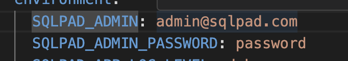

# SQL-Study Environment

このリポジトリはSQL学習のためのハンズオン環境を提供します。Docker Composeを使用して、PostgreSQLデータベースとSQLPad（SQLクエリツール）を簡単に起動できます。

## 概要

このプロジェクトは以下のコンポーネントで構成されています：

- **PostgreSQLデータベース** - 2つの独立したPostgreSQLインスタンス
- **SQLPad** - ウェブベースのSQLエディタ・可視化ツール
- **シードデータ** - 事前設定された接続とクエリのサンプル

## 必要条件

- Docker
- Docker Compose

## セットアップ手順

1. このリポジトリをクローンする
   ```
   git clone [リポジトリURL]
   cd sql-study
   ```

2. 管理者ユーザー情報の設定
   docker-compose.ymlファイル内の以下の項目を編集:
   - `SQLPAD_ADMIN`: 管理者のメールアドレス
   - `SQLPAD_ADMIN_PASSWORD`: 管理者のパスワード
   
   これらの情報は初回ログイン時の管理者アカウントとして使用されます。

   

3. 環境の起動
   ```
   docker-compose up -d
   ```
   入力したら起動が完了するまで待ちます。

4. アクセス方法
   ブラウザで以下のURLにアクセス:
   ```
   http://localhost:3000
   ```
   設定した管理者アカウントでログインします。

## データベース構成

このプロジェクトには2つの独立したPostgreSQLデータベースがあります：

- **sql-study-postgres** - 1つ目のPostgreSQLインスタンス
  - ユーザー: postgres
  - パスワード: postgres
  - データ保存先: ./postgres_data
  - 接続ホスト名: sql-study-postgres
  - ポート: 5432

- **sql-study-postgres2** - 2つ目のPostgreSQLインスタンス
  - ユーザー: postgres
  - パスワード: postgres
  - データ保存先: ./postgres2_data
  - 接続ホスト名: sql-study-postgres2
  - ポート: 5432

## SQLPad設定

SQLPadは以下の設定で動作します：

- ポート: 3000
- シードデータパス: /etc/sqlpad/seed-data
- データ保存先: ./sqlpad_data

## SQLPad利用方法

1. 管理者アカウントでログイン後、接続設定を確認・追加できます
2. クエリエディタでSQLを記述・実行
3. 結果セットをCSVとしてエクスポート可能
4. クエリを保存して再利用可能
5. チャートやグラフによるデータ可視化
6. 複数のデータベース間でのクエリ実行が可能

## データベース接続設定例

SQLPadから各データベースへ接続するための設定例：

```
ドライバ: PostgreSQL
名前: sql-study-postgres
ホスト: sql-study-postgres
ポート: 5432
データベース: postgres
ユーザー: postgres
パスワード: postgres
```

## プロジェクト構造

```
sql-study/
├── docker-compose.yml     # Dockerコンテナの設定ファイル
├── postgres/              # 1つ目のPostgreSQLコンテナ設定
│   ├── Dockerfile         # PostgreSQLコンテナのビルド設定
│   ├── csv/              # インポート用CSVデータディレクトリ
│   └── initdb/           # 初期化スクリプトディレクトリ
├── postgres2/             # 2つ目のPostgreSQLコンテナ設定
│   ├── Dockerfile        # PostgreSQLコンテナのビルド設定
│   ├── csv/              # インポート用CSVデータディレクトリ
│   └── initdb/           # 初期化スクリプトディレクトリ
├── seed-data/             # SQLPad用シードデータ
│   ├── connections/      # データベース接続設定
│   └── queries/         # 保存済みクエリ
├── postgres_data/         # PostgreSQLデータ永続化ディレクトリ
├── postgres2_data/        # PostgreSQL2データ永続化ディレクトリ
└── sqlpad_data/           # SQLPadデータ永続化ディレクトリ
```

## カスタマイズ

- データベースの初期化スクリプトは `postgres/initdb` および `postgres2/initdb` ディレクトリに配置できます
- CSVデータは `postgres/csv` および `postgres2/csv` ディレクトリに配置できます
- 接続設定は `seed-data/connections` ディレクトリにJSONファイルとして追加できます
- クエリサンプルは `seed-data/queries` ディレクトリにJSONファイルとして追加できます

## ユースケース

このSQL学習環境は以下のような場面で活用できます：

- SQL構文の基礎学習
- 複数のデータベース間でのクエリ練習
- チーム内でのSQLハンズオントレーニング
- データ分析スキルの向上
- PostgreSQLの機能検証・学習

## トラブルシューティング

データベースに接続できない場合：
- Dockerコンテナが正常に起動しているか確認してください
- `docker-compose logs` コマンドでエラーログを確認してください
- ネットワーク設定に問題がないか確認してください

SQLPadにログインできない場合：
- docker-compose.ymlで設定した管理者情報が正しいか確認してください
- SQLPadコンテナのログを確認してください: `docker-compose logs sql-study-pad`

## 環境起動・停止方法

環境を起動するには以下のコマンドを実行:
```
docker-compose up -d    # デタッチドモード（バックグラウンド実行）
```

または、ログを確認しながら起動する場合:
```
docker-compose up       # フォアグラウンドで実行、ログを表示
```

環境を停止するには以下のコマンドを実行:
```
docker-compose down
```

データベースデータを完全に削除するには:
```
docker-compose down
rm -rf postgres_data postgres2_data sqlpad_data
```

以上のコマンドを実行してください。

## 補足事項

ローカル環境の場合は、ブラウザのアドレスバーに「localhost:3000」と入力することでSQLPadにアクセスできます。リモート環境の場合は、サーバーのIPアドレスを使用して「http://[サーバーIP]:3000」のようにアクセスしてください。

アクセスURL: [http://localhost:3000/](http://localhost:3000/)

URLにアクセスすると、ログイン画面が表示されます。設定した管理者アカウントでログインしてください。

## 技術仕様

- **PostgreSQL**: バージョン 13.1
- **SQLPad**: バージョン 5.x
- **Docker**: バージョン 19.x 以上推奨
- **Docker Compose**: バージョン 1.27.x 以上推奨

## セキュリティに関する注意

この環境はデフォルトで簡単なパスワードを使用しています。本番環境や公開サーバーでの使用は避け、学習目的でのみ使用してください。

## サポート

このプロジェクトに関する質問やトラブルシューティングが必要な場合は、Issueを作成してください。